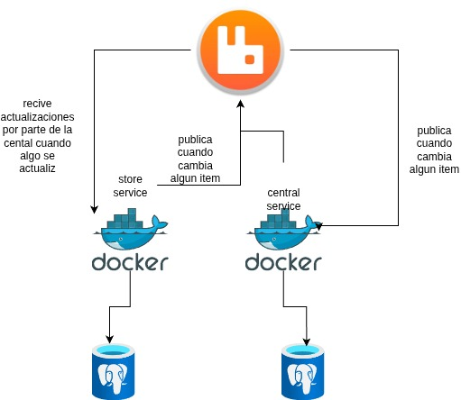
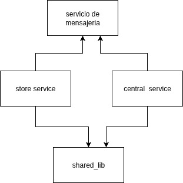

# Inventory Platform — Arquitectura (Hexagonal + Event-Driven)



Plataforma de inventario distribuido con **dos microservicios**:
- **central-service**: *system of record* del inventario (items y reservas).
- **store-service**: servicio por tienda que envía **comandos** al central y mantiene una **proyección local** para lectura.

La solución usa **Arquitectura Hexagonal (Ports & Adapters)** y se comunica **por eventos** a través de **RabbitMQ**. Cada servicio persiste su propio estado en **PostgreSQL**. El diseño es **escalable horizontalmente**: se pueden ejecutar múltiples réplicas de cada servicio porque el intercambio entre servicios es asíncrono y tolerante a fallos.

---

## 🧱 Principios de diseño

- **Hexagonal (Ports & Adapters)**: el dominio no depende de frameworks. Los *use cases* (capa *application*) son POJOs y se comunican con el exterior mediante **puertos**. Los detalles (REST, JPA, RabbitMQ, Outbox) viven en **adapters** dentro de *infrastructure*.
- **Event-Driven + CQRS**: comandos → central; eventos ← central. El store mantiene una **proyección** (`inventory_cache`) para lectura rápida.
- **Bases de datos separadas** por servicio (independencia y menor acoplamiento). Opcionalmente con **schemas** diferentes (`central`, `store`). 
- **Confiabilidad** con **Transactional Outbox** (central y store) + **Inbox/Log** (store). Idempotencia con `eventId` y control de **versión** por `sku`.

---

## 🧩 Componentes

### 1) central-service
- **Responsabilidad:** autoridad del inventario (*system of record*).
- **Entradas:**
  - Cola `central.commands` (bindings `command.inventory.*`) para **reserve / commit / cancel**.
  - Endpoints REST de **administración de ítems** y **consultas**.
- **Salidas:** publica al exchange `inventory` (topic):
  - `event.inventory.reserved | committed | cancelled`
  - `event.item.upserted` (cuando se crea/actualiza un ítem; evento “compacted” con `version`).
- **Persistencia:** tablas `items`, `reservations`, `outbox` (para publicación confiable).
- **Patrones:** **Transactional Outbox** + **Outbox Relay**, control de concurrencia, **idempotencia** e **inmutabilidad de eventos**.
- **Arquitectura:** hexagonal (casos de uso → puertos; adapters REST/JPA/AMQP).

---

### 2) store-service
- **Responsabilidad:** servicio por tienda; envía **comandos** al central y mantiene una **proyección local** para lectura.
- **Entradas:** cola `store.events` (bindings `event.inventory.*` y `event.item.*`).
- **Salidas:** comandos `command.inventory.reserve | commit | cancel` (a través de **Outbox**).
- **Persistencia:** `store_outbox` (comandos pendientes), `store_event_log` (inbox con `eventId`), `inventory_cache` (proyección por `sku` y `version`), y opcional `outbound_reservation` (saga local).
- **Patrones:** **Transactional Outbox** + **Inbox/Proyección idempotente**. **Gate por `version`** para aplicar solo cambios más nuevos. Opcional **anti-entropía** (rebuild por snapshot).
- **Arquitectura:** hexagonal (casos de uso puros; adapters REST/AMQP/JPA).

---

### 3) inventory-shared (módulo común, **no** microservicio)
- **Responsabilidad:** contener **contratos y utilidades compartidas** entre servicios.
- **Incluye:** `Topics` (routing keys), DTOs/record de **comandos** y **eventos**, utilidades de serialización/validación y *fixtures* para tests.
- **No incluye:** **entidades JPA**, **repositorios** ni adapters específicos de infraestructura (para evitar acoplamiento).
- **Objetivo:** mantener **compatibilidad de contratos** y reutilizar código **independiente de frameworks**.

---




---

## 🔁 Topología de mensajería (RabbitMQ)

- **Exchange**: `inventory` (tipo *topic*).
- **Queues**:
  - `central.commands`  ⟵ `command.inventory.*`  (consume **central-service**).
  - `store.events`      ⟵ `event.inventory.*` y `event.item.*` (consumen **stores**).
- Los mensajes usan `contentType=application/json` e incluyen `eventId` y `version` (cuando aplica) para idempotencia/orden.

---

## 📈 Escalabilidad horizontal

- Se pueden levantar N réplicas de **central-service** y **store-service** (`docker compose up --scale central-service=3`).  
- RabbitMQ soporta **competing consumers** para `central.commands`, repartiendo carga entre réplicas.  
- Las proyecciones de los stores son **independientes**; cada réplica puede procesar eventos.
- Outbox/Inbox + idempotencia permiten **reintentos** sin efectos secundarios.

---

## 🛡️ Consistencia y resiliencia

- **Outbox (central y store)**: primero se confirma en BD, luego se publica. Sin *dual-write*.
- **Inbox/Log (store_event_log)**: registro de todo lo recibido; `eventId` único evita duplicados.
- **Versión por `sku`**: sólo se aplica a la proyección si `version_evento > version_local`

---

## 📚 Endpoints (mínimo sugerido)

### central-service
- `POST /v1/admin/items` — crea/actualiza un item (`sku`, `onHand`); publica `event.item.upserted`.
- `PUT  /v1/admin/items/{sku}` — actualiza `onHand`.
- `GET  /v1/read/items/{sku}` — lee el estado del item.
- `GET  /v1/read/reservations?sku=&state=&page=&size=` — lista reservas (paginado).

### store-service
- `POST /v1/commands/reserve|commit|cancel` — encola comandos (via **Outbox**).
- `GET  /v1/read/cache/{sku}` — devuelve la proyección local.

---

## ▶️ Ejecución (Docker Compose)

```bash
docker compose up -d
# RabbitMQ UI: http://localhost:15672 (guest/guest)
# Central:     http://localhost:8082
# Store:       http://localhost:8081


## Demo en AWS (EC2 + Docker Compose)

La solución está desplegada en una instancia EC2 usando **Docker Compose**. Cada microservicio expone **Swagger UI** para probar los endpoints.

> **IP pública:** `18.222.29.73`  
> **Perfiles:** los servicios corren con `SPRING_PROFILES_ACTIVE=docker`.

### Endpoints públicos

- **central-service**
  - Base URL: `http://18.222.29.73:8082`
  - Swagger UI: `http://18.222.29.73:8082/swagger-ui/index.html`

- **store-service**
  - Base URL: `http://18.222.29.73:8081`
  - Swagger UI: `http://18.222.29.73:8081/swagger-ui/index.html`


### Probar rápido

```bash
# 1) Crear/actualizar un ítem en el central
curl -X POST http://18.222.29.73:8082/v1/admin/items \
  -H "Content-Type: application/json" \
  -d '{"sku":"SKU-001","onHand":100}'

# 2) Enviar una reserva desde la tienda
curl -X POST http://18.222.29.73:8081/v1/commands/reserve \
  -H "Content-Type: application/json" \
  -d '{"sku":"SKU-001","siteId":"BOG-01","reservationId":"R-123","qty":5}'


